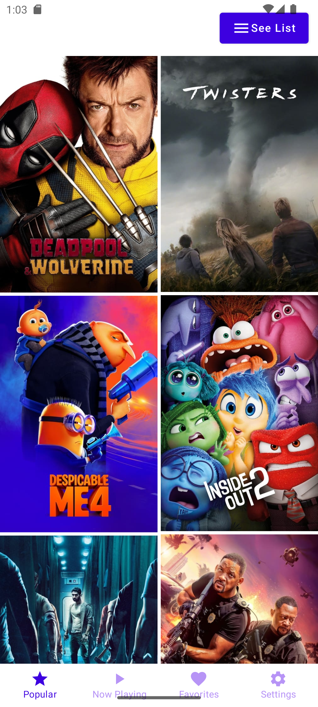
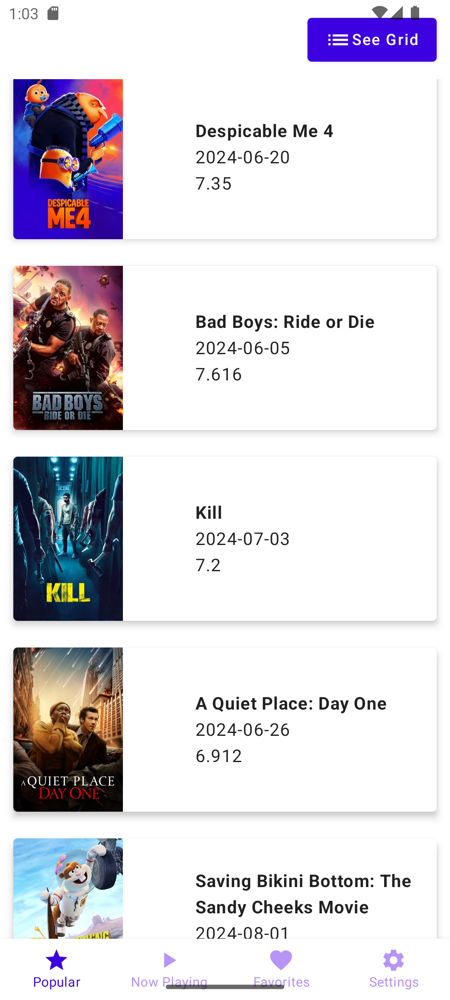
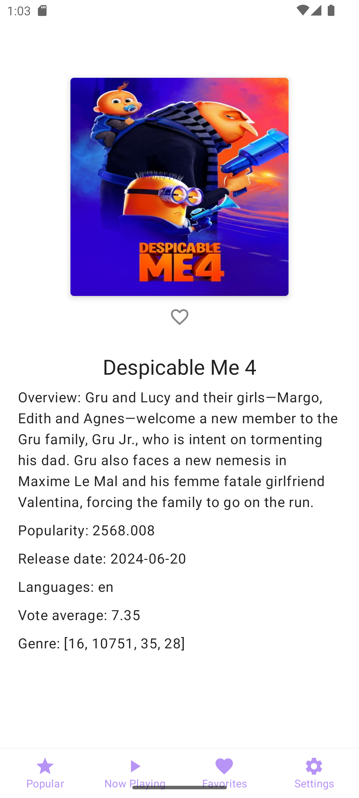
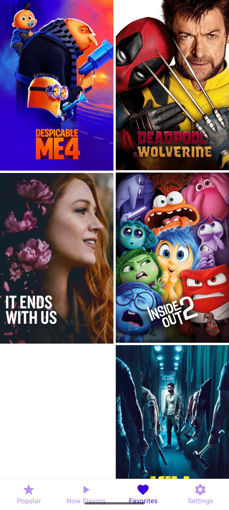

<h1 align="center">Movies TMDB</h1> 

<p align="center">
Native Android app built with Jetpack Compose, following a multi-modular architecture. 
It utilizes the TMDB movies API and adopts the MVVM pattern with Clean Architecture principles.

## Installation

Clone this repository and import into **Android Studio**

```bash
git clone https://github.com/munbonecci/android_kotlin_movies_tmdb.git
```

## Maintainers

This project is maintained by:

* [Edmundo Bonequi](http://github.com/munbonecci)

## Architecture

This App has the Clean Architecture approach where we can handle different layers,
including use cases and view model to obtain the data

## Built with

- [Kotlin](https://kotlinlang.org/) - For coding.
- [Dagger Hilt](https://developer.android.com/training/dependency-injection/hilt-android) -For dependency injection.
- [SecretsGradlePlugin](https://github.com/google/secrets-gradle-plugin) - For providing your secrets securely to your Android project.
- [TheMovieDB](https://www.themoviedb.org) - Movie database Api.
- [Room DB](https://developer.android.com/training/data-storage/room) - For save data locally.
- Jetpack
    - [Compose](https://developer.android.com/jetpack/compose?gclid=CjwKCAiAzKqdBhAnEiwAePEjkkbfP8b_r6c57F3jtdwOjxWpBbNOXVmpSnAUu4HKCid7KtSvfiiYeRoC1wYQAvD_BwE&gclsrc=aw.ds)
        - Android’s recommended modern toolkit for building native UI.
    - [Navigation Component](https://developer.android.com/guide/navigation/navigation-getting-started)
      - Handling and manage the navigation in the app.

## How I run the app?

- Clone the repository
- Open it in Android Studio
- Wait until dependencies are installed (Change you JDK to Corretto if necessary to avoid sync problems)
- Add your keys in local properties (apiKey="YOUR_API_KEY")
- Run app in your emulator or physical device




